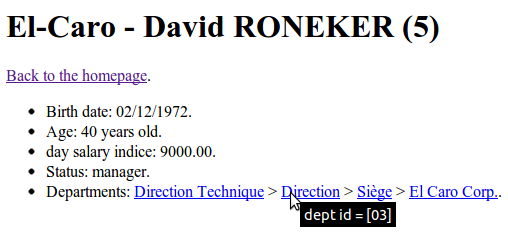

Pomm - Postgresql / PHP Object Model Manager
============================================

Qu'est ce que c'est ?
---------------------

Pomm est un **gestionnaire de modèle objet** dédié au moteur de base de données Postgresql. Qu'est ce qu'un gestionnaire de modèle objet ?

C'est avant tout un **hydrateur** d'objets qui utilise un convertisseur entre PHP et Postgresql pour assurer qu'un booléen dans Postgres sera vu depuis PHP comme tel, de même pour les tableaux, le type clé -> valeur 'HStore', les types géométriques, XML, JSON etc.

Cette fonctionnalité de conversion est très importante car le typage dans Postgresql est un élément incontournable de la définition du schéma par contrainte. La possibilité d'enrichir Postgresql avec des types personnalisés est prise en compte.

C'est également un gestionnaire de modèle orienté objet car Pomm crée des classes de mapping qui lient les structures SQL avec des objets PHP. Nous verrons là encore les grosses différences entre Pomm et les ORMs classiques et comment utiliser la puissance du SQL de Postgres au service d'une petite application. 

En quoi Pomm est il différent d'un ORM et pourquoi l'utiliser ?
---------------------------------------------------------------

Il est difficile de répondre rapidement à cette question sans tomber dans l'ornière du débat pro / anti ORMs. L'auteur développe avec PHP et Postgresql depuis plus d'une dizaine d'années. L'avènement des ORMs a certes changé la façon d'utiliser les bases de données en apportant des vraies couches modèles au sein du MVC mais ils ont également apporté un certain nombre d'inconvénients très handicapants pour les habitués des fonctionnalités des bases de données en général et de Postgresql en particulier. Pomm part donc du parti pris de ne fonctionner qu'avec Postgresql et son objectif est de permettre aux développeurs PHP de tirer parti de ses fonctionnalités au maximum. 

Un des plus gros problèmes des ORMs est qu'en calquant une logique orientée objet sur des structures SQL, ils figent ces dernières suivant la définition de classes (PHP ou autres) alors que par définition, les bases de données ne manipulent que [des ensembles](http://fr.wikipedia.org/wiki/Alg%C3%A8bre_relationnelle "algèbre relationnelle") de tuples, que les opérations ensemblistes sont insensibles à la taille de ces tuples et que le système de projection (SELECT) a été conçu pour les **façonner**. Un ensemble de base de données est donc par essence tout sauf figé. Nous verrons comment Pomm tire parti de la souplesse de PHP pour créer des objets élastiques s'adaptant à notre besoin. Ceci est d'autant plus appréciable que Postgresql sait manipuler des entités comme des objets, nous verrons comment faire des requêtes "orientées objet" en SQL. 

Un autre des problèmes des ORMs est lié à la couche d'abstraction: ils proposent un langage pseudo SQL orienté objet qui se cantonne souvent au plus petit commun dénominateur des fonctionnalités partagées entre les bases de données et il est souvent délicat de trouver comment faire quelque chose qu'on sait déjà faire en SQL classique. Nous verrons comment Pomm permet de faire directement des requêtes SQL sans les inconvénients de la construction fastidieuse -- que probablement certains d'entre vous ont connu -- qui menait à des scripts peu maintenables et peu testables.

Le présent article vous propose de créer une application web qui cherche et affiche des informations sur les employés de la société El-Caro Corporation.

Mise en place de l'application
------------------------------

L'application suivante n'utilise pas de framework et est volontairement minimaliste. Il est bien sûr fortement conseillé d'en utiliser un, il existe à ce propos un adaptateur pour [Silex et Symfony](http://pomm.coolkeums.org/download). Ne vous étonnez donc pas de ne pas trouver de belles URL (routing), de contrôleurs encapsulés (et testables), de moteur de template (fort utile) et autres bonnes pratiques, cela va forcément s'éloigner de ce à quoi pourrait ressembler une application respectueuse des préceptes RESTFULL mais cela va nous permettre de nous concentrer sur le sujet de cet article.

Nous allons utliser [Composer](http://composer.org "composer, c'est le bien.") pour installer Pomm et instancier un auto-loading dans notre projet. Pour cela, il n'est pas utile de créer plus qu'un fichier `composer.json` comme suit dans un répertoire vierge :

```json
{
    "minimum-stability": "dev",
    "require": {
        "pomm/pomm": "dev-master"
    }
}
```

Reste à appeler le script `composer.phar install` pour que composer installe Pomm et le prenne en compte dans son autoloader.


Bienvenue dans la société El-Caro Corp.
---------------------------------------

Ce tutoriel vous propose de créer une application simpliste de gestion des salariés de la société informatique « El-Caro Corporation ». Cette société est divisée en départements hiérarchisés et chaque employé appartient à un département lui même pouvant être fils d'un autre service. La structure de la base de données est la suivante :


Nous allons créer un schéma nommé `company` dans notre base de données pour y créer la structure décrite ci dessus :

```sql
$> CREATE SCHEMA company;
$> SET search_path TO company, public;
$> SHOW search_path;
company, public
```

La commande `SHOW` doit nous retourner `company, public` signe que le client Postgres va d'abord chercher les objets par défaut dans le schéma `company` puis ensuite dans le schéma par défaut `public`. Un des avantages d'utiliser un schéma est que si l'on souhaite "passer l'éponge", il suffit de lancer un `DELETE SCHEMA company CASCADE` et de recommencer. Une fois le schéma créé, implémentons la structure :

```sql
$> CREATE TABLE department (
    department_id       serial      PRIMARY KEY,
    name                varchar     NOT NULL,
    parent_id           integer     REFERENCES department (department_id)
    );
```

Tel que nous l'avons décrite, cette table possède un identifiant technique -- un entier -- qui s'auto-incrémente à l'aide d'une séquence qui est auto générée et initialisée à la création de la table comme l'indique Postgresql. Notons que le `parent_id` même s'il est indiqué comme référent au département parent peut être nul dans le cas du département racine. En revanche la contrainte de clé étrangère forcera tout département indiqué comme père à exister au préalable dans la table.

```sql
$> CREATE TABLE employee (
    employee_id         serial          PRIMARY KEY,
    first_name          varchar         NOT NULL,
    last_name           varchar         NOT NULL,
    birth_date          date            NOT NULL CHECK (age(birth_date) >= '18 years'::interval),
    is_manager          boolean         NOT NULL DEFAULT false,
    day_salary          numeric(7,2)    NOT NULL,
    department_id       integer         NOT NULL REFERENCES department (department_id)
    );
```

Nous voyons ici que la structure d'un employé est fortement contrainte. Une vérification -- pour l'exemple -- d'age est faite pour vérifier que la date de naissance entrée ne corresponde pas à un mineur. Dans le cas d'un employé, l'appartenance à un département est rendue obligatoire par la contrainte `NOT NULL` sur le champs de clé étrangère `department_id` vers la table `department`.

Un jeu de données est disponible dans [ce Gist](https://gist.github.com/raw/4664191/c1fbaba2c82b4d2950709ec2c208852894d16152/structure.sql "wget me").

Génération du modèle PHP
------------------------

À partir de cette structure de base de données, Pomm sait construire les classes qui correspondent aux tables pour nous permettre de nous affranchir des traitements fastidieux de PDO. Dans un premier temps, nous créons un fichier appelé `bootstrap.php` qui sera inclus par nos scripts et dont le but est d'initialiser l'autoloading et la base de données.

```php
<?php // bootstrap.php

$loader = require __DIR__."/vendor/autoload.php";
$loader->add(null, __DIR__."/lib");

$database = new Pomm\Connection\Database(array('dsn' => 'pgsql://greg/greg', 'name' => 'el_caro'));

return $database->getConnection();
```


Notez que nous spécifions le répertoire `lib` comme répertoire par défaut pour trouver les namespaces à l'autoloader. 

Pour maintenant générer les fichiers de mapping, créons le fichier `generate_model.php` dont une version plus générale est disponible dans [ce Gist](https://gist.github.com/1510801#file-generate_model-php "generate_model.php").

```php
<?php //generate_model.php
 
$connection = require(__DIR__."/bootstrap.php");
 
$scan = new Pomm\Tools\ScanSchemaTool(array(
    'schema'     => 'company',
    'database'   => $connection->getDatabase(),
    'prefix_dir' => __DIR__."/lib"
    ));
$scan->execute();
$scan->getOutputStack()->setLevel(254);
 
foreach ( $scan->getOutputStack() as $line )
{
    printf("%s\n", $line);
}
```

Ce script utilise un des outils fournis avec Pomm: [le scanner de schéma](http://pomm.coolkeums.org/documentation/manual-1.1#map-generation-tools "documentation"). Cet outil utilise l'inspecteur de base de données de Pomm pour générer des classes de mapping liées aux tructures stockées en base. Dans le cas présent, nous lui demandons de scanner le schéma `company` et de générer les fichiers dans le sous répertoire `lib`, là où nous avons fait pointer l'auto-loader par défaut dans le fichier `bootstrap.php`. Un appel à ce script va nous générer la structure de fichiers suivante ;

    lib/
    └── ElCaro
        └── Company
            ├── Base
            │   ├── DepartmentMap.php
            │   └── EmployeeMap.php
            ├── DepartmentMap.php
            ├── Department.php
            ├── EmployeeMap.php
            └── Employee.php

Cette architecture ne choquera pas les utilisateurs habitués à utiliser des ORMs. Nous pouvons constater que le namespace utilisé par les classes de modèle est `\ElCaro\Company` c'est à dire le nom de la base de donnée passé en paramètre lors de l'instanciation de la classe `Database` avec le nom du schéma. Ainsi, il est possible d'avoir plusieurs classes de tables portant le même nom mais déclarées dans des schémas Postgresql différents. D'autre part, chaque table génère 3 classes :

 * Une classe portant le même nom que la table à la casse près
 * Une classe portant le même nom mais affublé du suffix `Map`
 * La même classe dans le sous namespace `Base`.

Les classes du sous namespace `Base` contiennent la définition déduite depuis la structure de la base de données. Ces fichiers seront écrasés à chaque introspection en cas d'évolution de la structure de la base, il serait donc malvenu qu'elle contienne du code que nous aurions pu placer là. C'est pour cela que la classe `Map` hérite de sa consœur dans `Base`. Vous pouvez y placer votre code, cette classe ne sera pas écrasée. 

Les utilisateurs d'ORMs ne seront pas non plus surpris d'apprendre que la classe Map est l'outil qui s'occupera de gérer la vie leur entité correspondante avec la base de données, à savoir :

 * `DepartmentMap` sauvegarde, génère et renvoie des collections d'entités `Department`.
 * `EmployeeMap` renvoie des collections d'entités `Employee`.

Premiers pas
------------

Pour notre première interface, nous allons afficher la liste des employés. Créons le fichier index.php avec le code PHP suivant:

```php
<?php //index.php

// CONTROLLER
$connection = require(__DIR__."/bootstrap.php");
 
$employees = $connection
    ->getMapFor('\ElCaro\Company\Employee')
    ->findAll();

// TEMPLATE
?>
<html>
  <head>
    <meta http-equiv="Content-Type" content="text/html; charset=utf-8">
  </head>
  <body>
    <h1>El-Caro - Workers list</h1>
<?php if ($employees): ?>
    <ul>
  <?php foreach($employees as $employee): ?>
      <li><a href="/show_employee.php?employee_id=<?php echo $employee["employee_id"] ?>"><?php echo $employee["first_name"]." ".$employee["last_name"] ?></a></li>
  <?php endforeach ?>
    </ul>
<?php else: ?>
    <p>No employees !?!? There must be a bug somewhere...</p>
<?php endif ?>
  </body>
</html>
```

Commentons le code ci dessus :

 1. La connexion nous permet d'obtenir des instances de classes Map.
 2. La classe Map sait faire des requêtes qui ramènent des collections de leur entité correspondante.
 3. Ces collections sont accessibles via `foreach` et retournent leurs entités.
 4. Les valeurs internes des entités sont accessibles entre autres via la notation de tableau.

L'utilisation de la notation de tableau est pratique dans les templates et elle équivaut complètement à l'utilisation d'accesseurs. Ainsi `$employee['first_name']` est équivalent à `$employee->getFirstName()`. Cela permet par exemple, si on souhaite formater le prénom capitalisé et le nom en majuscule, de juste avoir à surcharger `getFirstName()` et `getLastName()` dans la classe `Employee` :

```php
<?php // lib/ElCaro/Company/Employee.php

namespace ElCaro\Company;

use \Pomm\Object\BaseObject;
use \Pomm\Exception\Exception;

class Employee extends BaseObject
{
    public function getFirstName()
    {
        return ucwords($this->get('first_name'));
    }

    public function getLastName()
    {
        return strtoupper($this->get('last_name'));
    }

    public function __toString()
    {
        return sprintf("%s %s", $this['first_name'], $this['last_name']);
    }
}
```

Seuls les accesseurs génériques `get()`, `set()`, `has()` et `clear()` ne peuvent être surchargés car ils sont utilisés pour accéder aux valeurs brutes de l'objet. Nous en aurions besoin ici si nous souhaitions par exemple implémenter une recherche par le prénom alors que la méthode `getFirstName()` ne nous retourne pas la valeur effectivement stockée en base. 

Dans la vraie vie™, un tel exemple ne serait pas vraiment exploitable à cause du volume de données dès que le nombre d'employés dépasse quelque dizaines. Cela ne nous aurait pas coûté tellement plus cher de [les classer par ordre alphabétique](http://pomm.coolkeums.org/documentation/manual-1.1#findall) et de [paginer notre liste](http://pomm.coolkeums.org/documentation/manual-1.1#pagers) de résultats dans le contrôleur.

Entités élastiques
------------------

Intéressons nous maintenant à l'affichage des données d'un utilisateur :

```php
<?php // show_employee.php

$connection = require(__DIR__."/bootstrap.php");

// CONTROLLER

if (!$employee = $connection
    ->getMapFor('\ElCaro\Company\Employee')
    ->findByPk(array('employee_id' => $_GET['employee_id'])))
{
    printf("No such user.");
    exit;
}
// TEMPLATE
?>
<html>
  <head>
    <meta http-equiv="Content-Type" content="text/html; charset=utf-8">
  </head>
  <body>
    <h1>El-Caro - <?php echo $employee ?> (<?php echo $employee["employee_id"] ?>)</h1>
    <p><a href="/index.php">Back to the homepage</a>.</p>
    <ul>
      <li>Birth date: <?php echo $employee["birth_date"]->format("d/m/Y") ?>.</li>
      <li>day salary indice: <?php printf("%05.2f", $employee["day_salary"]) ?>.</li>
      <li>Status: <?php echo $employee["is_manager"] ? "manager" : "worker" ?>.</li>
      <li>Department: <?php echo $employee["department_id"] ?>.</li>
    </ul>
  </body>
</html>
```

Là encore, nous pouvons voir que le convertisseur a fait son travail, la date de naissance est un objet PHP `DateTime`, le champs `is_manager` est un booléen et on peut formater `day_salary` convenablement.

Imaginons maintenant qu'en plus de la date de naissance, nous avions besoin d'avoir directement l'age de la personne. Il est bien sûr facile de créer un accesseur supplémentaire `getAge()` dans la classe `Employee` dans laquelle nous calculerions en PHP l'age à partir de la date de naissance mais pourquoi ne pas le demander directement à Postgresql en utilisant la fonction `age()` ? 

Il faut savoir que Pomm n'utilise jamais l'alias `*` dans ses requêtes, il utilise pour cela la méthode `getSelectFields()` définie dans les classes Map. Par défaut, cette méthode retourne tous les champs de la table, mais il est possible de la surcharger pour en enlever ou en ajouter. En d'autres termes, **cette méthode définit la projection de l'objet en base de données vers l'objet entité PHP**.

```php
<?php // lib/ElCaro/Company/EmployeeMap.php

namespace ElCaro\Company;

use ElCaro\Company\Base\EmployeeMap as BaseEmployeeMap;
use ElCaro\Company\Employee;
use \Pomm\Exception\Exception;
use \Pomm\Query\Where;

class EmployeeMap extends BaseEmployeeMap
{
    public function getSelectFields($alias = null)
    {
        $fields = parent::getSelectFields($alias);
        $fields['age'] = 'age(birth_date)';

        return $fields;
    }
}
```

Et ajoutons la ligne suivante dans la partie template de `show_employee.php` :

    <li>Age: <?php echo $employee['age'] ?>.</li>

En rafraîchissant la page, celle-ci affiche désormais quelque chose ressemblant à `Age: 27 years 11 mons 2 days.`. C'est la sortie brute de la commande `age()` de Postgresql, Pomm ne sachant comment interpréter cette sortie, la convertit au format String. Il est possible d'étendre la définition de notre entité en y ajoutant le type de cette nouvelle colonne virtuelle afin qu'elle soit prise en charge par le convertisseur quand elle existe :

```php
<?php // lib/ElCaro/Company/EmployeeMap.php
// [...]

    public function initialize()
    {
        parent::initialize();
        $this->addVirtualField('age', 'interval');
    }
```

Si vous rafraîchissez désormais la page, celle-ci présente une erreur comme quoi PHP ne sait pas comment afficher une instance de la classe PHP `DateInterval` : le convertisseur a bien fait son travail. Changez l'affichage de l'age par la ligne suivante :

      <li>Age: <?php echo $employee['age']->format("%y") ?> years old.</li>

Avant de conclure ce chapitre, notons que la méthode `getSelectFields()` que nous avons surchargée est génératrice de problèmes car le nouveau champs `age` que nous avons ajouté est insensible à l'alias. Cela peut -- et va -- poser des problèmes lors de requêtes complexes où ce champs peut apparaitre dans plusieurs ensembles. La laisser ainsi occasionnerait des erreurs SQL de type "champs ambigu" assez délicats à déboguer. Pour prévenir cela, corrigeons la méthode comme suit :

```php
    public function getSelectFields($alias = null)
    {
        $fields = parent::getSelectFields($alias);
        $alias = is_null($alias) ? "" : sprintf("%s.", $alias);
        $fields['age'] = sprintf('age(%s"birth_date")', $alias);

        return $fields;
    }
```

Requêtes SQL personnalisées
---------------------------

Si désormais, nous souhaitons afficher le nom du service au lieu du `department_id`, appeler `findByPk()` est insuffisant, nous allons devoir créer une jointure pour ramener cette information. Créons une méthode dans notre classe de modèle dont le but sera de ramener un employé avec des informations sur son service. On peut coucher immédiatement la requête nécessaire (Le [NATURAL JOIN](http://www.postgresql.org/docs/8.4/static/queries-table-expressions.html "documentation postgresql") de postgres permet de faire une jointure sur deux ensembles en prenant les champs homonymes) :

```sql
SELECT *, dept.name FROM employee NATURAL JOIN department dept WHERE employee_id = ?
```

Cependant, la requête sous cette forme présente des inconvénients :

 * elle n'utilise pas la méthode de projection `getSelectFields()` et n'affichera pas le champs `age`.
 * indiquer le nom des tables "en dur" peut nous poser des problèmes d'évolutivité.

Les classes Map de Pomm proposent pour cela des méthodes pour avoir ces informations de façon dynamique. Idéalement, notre requête pourrait être vue sous cette forme:

```sql
SELECT %A, dept.name FROM %B NATURAL JOIN %C WHERE employee_id = ?
```

 * %A est la liste des colonnes que l'on souhaite ramener de la table B.
 * %B est la table des employés.
 * %C est la table des départements.

B et C sont facilement remplacés grâce à la méthode `getTableName()` de chaque classe Map. Nous savons que l'on peut obtenir la liste des colonnes a ramener avec la méthode `getSelectFields()` mais cette méthode retourne un tableau associatif dont la clé est l'alias du champs et la valeur hé bien ... sa valeur. Il faut donc formater ce tableau en une liste de champs. Les classes Map proposent pour cela des méthodes dédiées : [les formateurs](http://pomm.coolkeums.org/documentation/manual-1.1#fields-formatters).

 * `formatFields(methode, alias)`
 * `formatFieldsWithAlias(methode, alias)`

```php
$this->formatFields('getSelectFields', 'pika');
// "pika.employee_id", "pika.first_name", "pika.last_name", "pika. ....
$this->formatFieldsWithAlias('getSelectFields', 'plop');
// "plop.employee_id" AS "employee_id", "plop.first_name" AS "first_name", ...
```

Ainsi équipé, il est facile de se concentrer sur ce que font les requêtes plutôt que sur la syntaxe elle même :

```php
<?php // lib/ElCaro/Company/EmployeeMap.php
// [...]

    public function initialize()
    {
// [...]
        $this->addVirtualField('department_name', 'varchar');
    }

    public function getEmployeeWithDepartment($employee_id)
    {
        $department_map = $this->connection->getMapFor('\ElCaro\Company\Department');
        $sql = <<<SQL
SELECT
  %s, dept.name AS department_name
FROM
  %s emp
    NATURAL JOIN %s dept
WHERE
    emp.employee_id = ?
SQL;

        $sql = sprintf($sql,
            $this->formatFieldsWithAlias('getSelectFields', 'emp'),
            $this->getTableName(),
            $department_map->getTableName()
        );

        return $this->query($sql, array($employee_id))->current();
    }
```
Nous utilisons cette méthode dans la partie contrôleur, à la place de `findByPk`, afin de récupérer l'employé demandé :

```php
if (!$employee = $connection
    ->getMapFor('\ElCaro\Company\Employee')
    ->getEmployeeWithDepartment($_GET['employee_id']))
{
    printf("No such user.");
    exit;
}
```

Et dans le template correspondant :

```php
      <li>Department: <?php echo $employee["department_name"] ?>.</li>
```

La possibilité de faire des requêtes SQL depuis les classes Map est une fonctionnalité extrêmement puissante car elle permet d'utiliser tous les mécanismes SQL de Postgresql. Par exemple, les départements sont une structure arborescente, nous pouvons demander à Postgresql de ramener sous forme de tableaux l'ensemble des services auxquels chaque utilisateur appartient. Pour cela, nous utilisons une requête récursive avec un agrégateur de tableaux et déclarons notre colonne comme un tableau de chaîne de caractères :

```php
<?php // lib/ElCaro/Company/EmployeeMap.php
// [...]

    public function initialize()
    {
        parent::initialize();
        $this->addVirtualField('age', 'interval');
        $this->addVirtualField('department_names', 'varchar[]');
    }

    public function getEmployeeWithDepartment($employee_id)
    {
        $department_map = $this->connection->getMapFor('\ElCaro\Company\Department');
        $sql = <<<SQL
WITH RECURSIVE
  depts  (department_id, name, parent_id) AS (
      SELECT %s FROM %s NATURAL JOIN %s emp WHERE emp.employee_id = ?
    UNION ALL
      SELECT %s FROM depts parent JOIN %s d ON parent.parent_id = d.department_id
  )
SELECT
  %s, array_agg(depts.name) AS department_names
FROM
  %s emp,
  depts
WHERE
    emp.employee_id = ?
GROUP BY
  %s
SQL;

        $sql = sprintf($sql,
            $department_map->formatFields('getSelectFields'),
            $department_map->getTableName(),
            $this->getTableName(),
            $department_map->formatFields('getSelectFields', 'd'),
            $department_map->getTableName(),
            $this->formatFieldsWithAlias('getSelectFields', 'emp'),
            $this->getTableName(),
            $this->formatFields('getGroupByFields', 'emp')
        );

        return $this->query($sql, array($employee_id, $employee_id))->current();
    }
```

Et dans le template :

```php
      <li>Departments: <?php echo join(' &gt; ', $employee["department_names"]) ?>.</li>
```

La requête ci dessus, utilise la clause SQL `WITH` qui permet de créer des ensembles nommés et de les rappeler. Cela évite de faire des sub-select. Le premier ensemble aliasé `depts` est la clause récursive. Elle possède un ensemble de départ -- le département direct de l'employé -- uni à une requête récursive qui remonte l'arbre jusqu'à ce que ça ne soit plus possible. L'ensemble `depts` va donc contenir tous les départements de l'employé. La requête finale va tout simplement faire un CROSS JOIN entre les informations de l'employé et l'aggrégat en tableaux du nom de ses départements.

Requêtes orientées objet
------------------------

Afficher l'arbre des départements de chaque utilisateur est une bonne chose mais cela serait plus intéressant si on pouvait avoir un lien sur chaque département qui mènerait à la fiche du département contenant tous ses employés. Dans l'état actuel de la requête, on ne ramène que les noms des départements, il nous faudrait également leurs identifiants. On peut toujours ajouter une colonne contenant un tableau d'identifiant mais cela n'est pas très pratique. 

Postgresql propose une fonctionnalité intéressante : lorsque vous déclarez une table, Postgesql va automatiquement créer le type composite correspondant. C'est à dire que le type `company.department` existe et que vous pouvez faire des requêtes de ce type directement :

    elcaro$> SELECT department FROM department;
    ┌─────────────────────────────┐
    │         department          │
    ├─────────────────────────────┤
    │ (1,"el caro corp.",)        │
    │ (2,siège,1)                 │
    │ (3,direction,2)             │
    │ (4,comptabilité,1)          │
    │ (5,"direction technique",3) │
    │ (6,"hotline niveau II",5)   │
    │ (7,"datacenter skynet",1)   │
    │ (8,"technique & réseau",7)  │
    │ (9,"Hotline niveau I",7)    │
    │ (10,Direction,7)            │
    └─────────────────────────────┘
    (10 rows)

Le résultat de la requête ci dessus ne possède **qu'une seule colonne** de type `department`. Ce que l'on appelle pompeusement *requête orientée objet* en Postgresql n'est que le fait de manipuler des tuples comme des valeurs mais cela est déjà extrêmement puissant car si on modifie la ligne suivante dans la requête SQL vue plus haut:

```sql
...
SELECT
  %s, array_agg(depts) AS departments
FROM
  %s emp,
  depts
...
```

Dès lors, la colonne `departments` contiendra un tableau d'entités `department`. Il convient de changer la ligne correspondante dans le template pour afficher les liens :

```php
      <li>Departments: <?php echo join(' &gt; ', array_map(function($dept) {
          return sprintf(
              '<a href="/show_department.php?department_id=%d">%s</a>', 
              $dept["department_id"],
              $dept["name"]); 
      }, $employee["departments"])) ?>.</li>
```

Mais cela ne suffit pas. PHP va se plaindre que l'argument passé à `array_map` n'est pas un tableau et il aura raison. N'ayant pas déclaré la colonne `departments` de la classe `Employee`, Pomm va juste y placer la chaîne de caractères renvoyée par Postgresql. Il faut donc renseigner le convertisseur que la colonne `departments` contient un tableau de type `department`. Seul souci : Pomm ne charge pas par défaut de convertisseur pour ce type de données. Nous allons donc déclarer ce convertisseur auprès de l'instance de base de données dans le fichier `bootstrap.php`:

```php
<?php // bootstrap.php

$loader = require __DIR__."/vendor/autoload.php";
$loader->add(null, __DIR__."/lib");

$database = new Pomm\Connection\Database(array('dsn' => 'pgsql://greg/greg', 'name' => 'el_caro'));
$database->registerConverter(
    'Department', 
    new \Pomm\Converter\PgEntity($database->getConnection()->getMapFor('\ElCaro\Company\Department')), 
    array('company.department')
    );

return $database->getConnection();
```

Nous déclarons un nouveau convertisseur appelé `Department` qui associe le(s) type(s) Postgres `company.department` à l'instance de convertisseur `PgEntity`. Reste à utiliser ce convertisseur dans la colonne virtuelle `departments` de chaque `Employee`:

```php
<?php // lib/ElCaro/Company/EmployeeMap.php
// [...]

class EmployeeMap extends BaseEmployeeMap
{
    public function initialize()
    {
        parent::initialize();
        $this->addVirtualField('age', 'interval');
        $this->addVirtualField('departments', 'company.department[]');
    }
```


